# MyGate Clone – Full Flow Diagrams & Scenarios

This document describes all user and system flows in the codebase using Mermaid diagrams. Use a [Mermaid-compatible viewer](https://mermaid.live/) or GitHub to render the diagrams.

---

## 1. System Architecture Overview

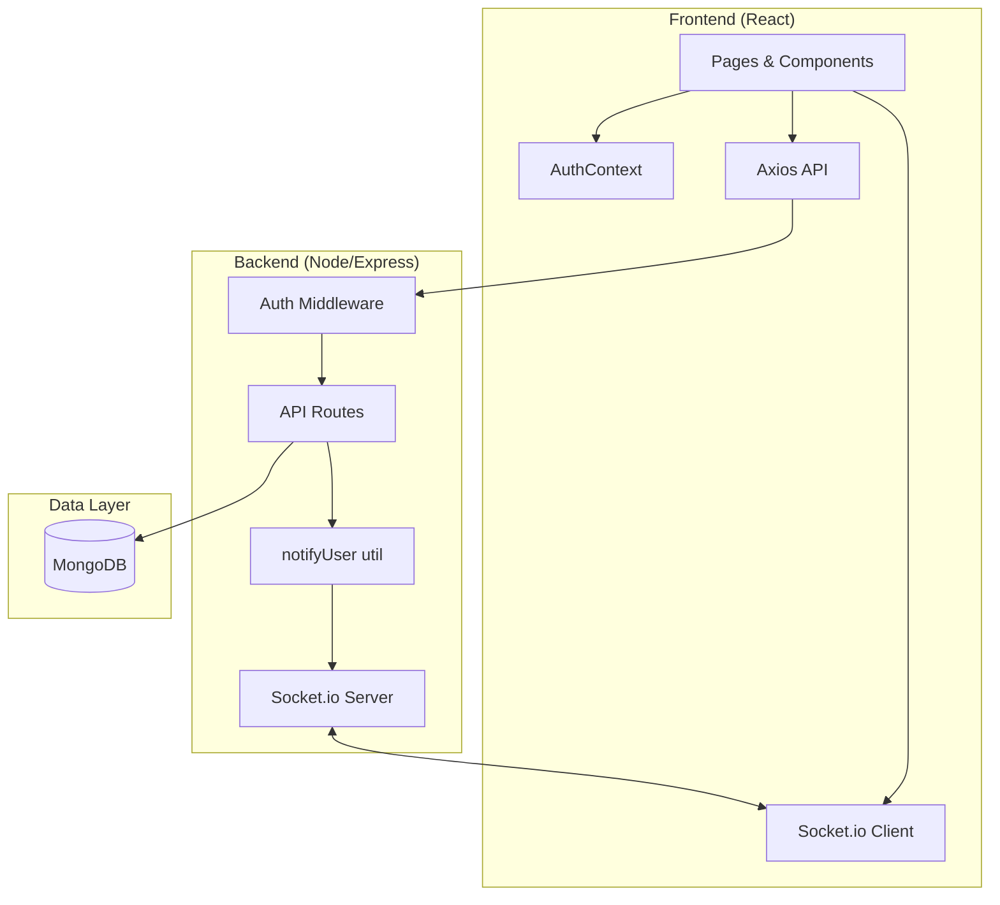
```mermaid
flowchart TB
    subgraph Client["Frontend (React)"]
        UI[Pages & Components]
        AuthCtx[AuthContext]
        SocketC[Socket.io Client]
        API[Axios API]
    end

    subgraph Backend["Backend (Node/Express)"]
        Auth[Auth Middleware]
        Routes[API Routes]
        SocketS[Socket.io Server]
        Notify[notifyUser util]
    end

    subgraph Data["Data Layer"]
        MongoDB[(MongoDB)]
    end

    UI --> AuthCtx
    UI --> API
    UI --> SocketC
    API --> Auth
    Auth --> Routes
    Routes --> MongoDB
    Routes --> Notify
    Notify --> SocketS
    SocketS <--> SocketC
```

---

## 2. User Roles & Access Summary

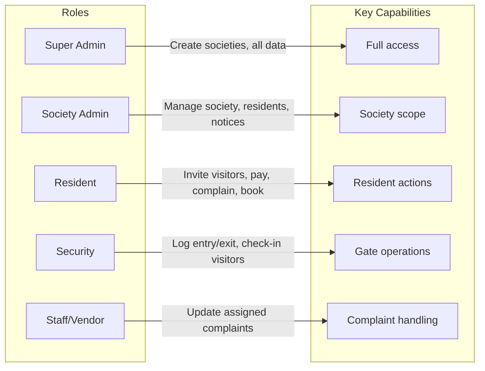
```mermaid
flowchart LR
    subgraph Roles["Roles"]
        SA[Super Admin]
        SAdmin[Society Admin]
        R[Resident]
        Sec[Security]
        St[Staff/Vendor]
    end

    subgraph Capabilities["Key Capabilities"]
        SA --> |Create societies, all data| A1[Full access]
        SAdmin --> |Manage society, residents, notices| A2[Society scope]
        R --> |Invite visitors, pay, complain, book| A3[Resident actions]
        Sec --> |Log entry/exit, check-in visitors| A4[Gate operations]
        St --> |Update assigned complaints| A5[Complaint handling]
    end
```

| Role | Auth | Visitors | Deliveries | Vehicles | Notices | Complaints | Payments | Bookings | Societies |
|------|------|----------|------------|----------|---------|------------|----------|----------|-----------|
| **Super Admin** | ✓ | All | All | All | Create, All | Assign, Status | View All | Approve/Reject | CRUD, All |
| **Society Admin** | ✓ | Society | Society | Society | Create, Society | Assign, Status | Society | Approve/Reject | Update own |
| **Resident** | ✓ | Invite, Approve own | Expect, Approve own | Register | View, Vote | Create, Own | Create, Own | Create, Cancel | — |
| **Security** | ✓ | Check-in/out | Check-in, Deliver | Entry/Exit | View | — | — | — | — |
| **Staff** | ✓ | — | — | — | View | Assigned, Status | — | — | — |

---

## 3. Authentication Flows

### 3.1 Registration Flow

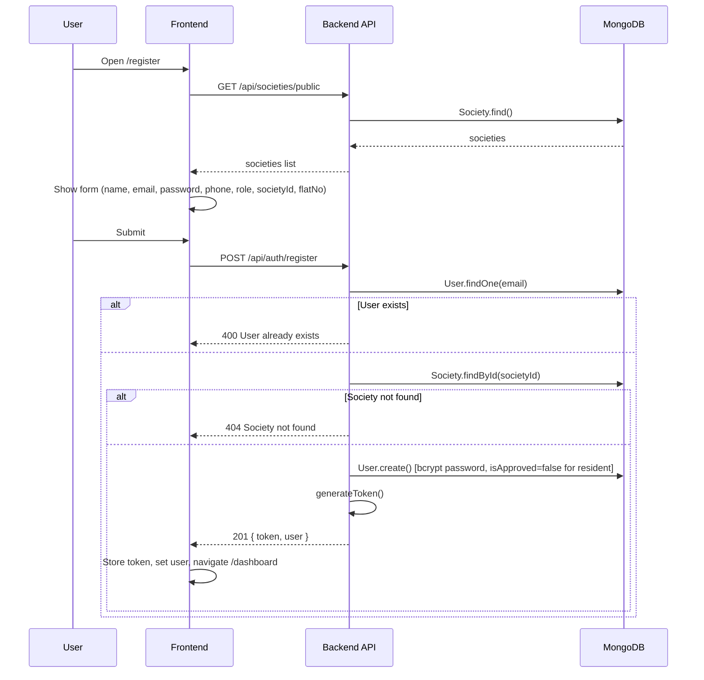
```mermaid
sequenceDiagram
    participant U as User
    participant F as Frontend
    participant API as Backend API
    participant DB as MongoDB

    U->>F: Open /register
    F->>API: GET /api/societies/public
    API->>DB: Society.find()
    DB-->>API: societies
    API-->>F: societies list
    F->>F: Show form (name, email, password, phone, role, societyId, flatNo)
    U->>F: Submit
    F->>API: POST /api/auth/register
    API->>DB: User.findOne(email)
    alt User exists
        API-->>F: 400 User already exists
    else
        API->>DB: Society.findById(societyId)
        alt Society not found
            API-->>F: 404 Society not found
        else
            API->>DB: User.create() [bcrypt password, isApproved=false for resident]
            API->>API: generateToken()
            API-->>F: 201 { token, user }
            F->>F: Store token, set user, navigate /dashboard
        end
    end
```

### 3.2 Login Flow

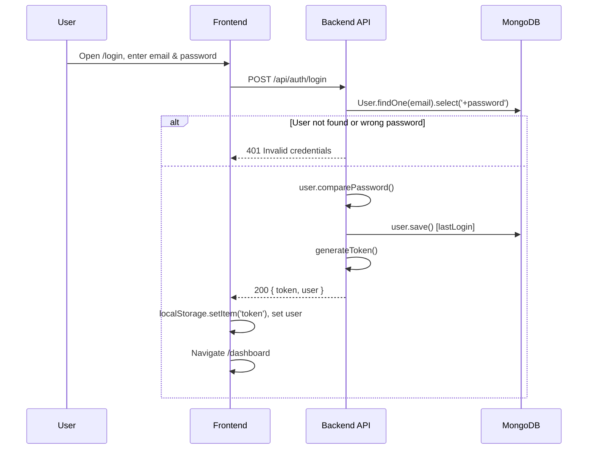
```mermaid
sequenceDiagram
    participant U as User
    participant F as Frontend
    participant API as Backend API
    participant DB as MongoDB

    U->>F: Open /login, enter email & password
    F->>API: POST /api/auth/login
    API->>DB: User.findOne(email).select('+password')
    alt User not found or wrong password
        API-->>F: 401 Invalid credentials
    else
        API->>API: user.comparePassword()
        API->>DB: user.save() [lastLogin]
        API->>API: generateToken()
        API-->>F: 200 { token, user }
        F->>F: localStorage.setItem('token'), set user
        F->>F: Navigate /dashboard
    end
```

### 3.3 Protected Route & JWT Flow

```mermaid
flowchart LR
    A[Request with Bearer token] --> B{Token present?}
    B -->|No| C[401 Unauthorized]
    B -->|Yes| D[JWT verify]
    D --> E{Valid?}
    E -->|No| C
    E -->|Yes| F[Load user from DB]
    F --> G{User active?}
    G -->|No| C
    G -->|Resident & not approved| H[403 Pending approval]
    G -->|OK| I[authorize(roles)]
    I --> J{Role allowed?}
    J -->|No| K[403 Forbidden]
    J -->|Yes| L[Route handler]
```

### 3.4 Forgot Password & Reset

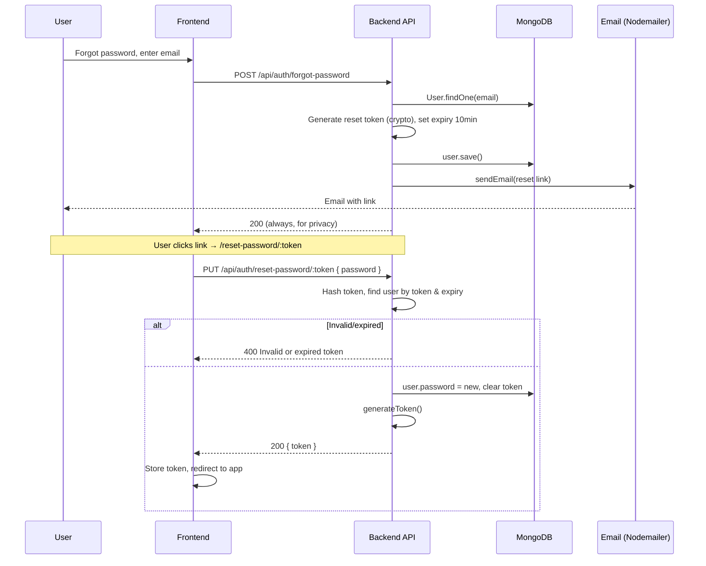
```mermaid
sequenceDiagram
    participant U as User
    participant F as Frontend
    participant API as Backend API
    participant DB as MongoDB
    participant Mail as Email (Nodemailer)

    U->>F: Forgot password, enter email
    F->>API: POST /api/auth/forgot-password
    API->>DB: User.findOne(email)
    API->>API: Generate reset token (crypto), set expiry 10min
    API->>DB: user.save()
    API->>Mail: sendEmail(reset link)
    Mail-->>U: Email with link
    API-->>F: 200 (always, for privacy)

    Note over U,API: User clicks link → /reset-password/:token
    F->>API: PUT /api/auth/reset-password/:token { password }
    API->>API: Hash token, find user by token & expiry
    alt Invalid/expired
        API-->>F: 400 Invalid or expired token
    else
        API->>DB: user.password = new, clear token
        API->>API: generateToken()
        API-->>F: 200 { token }
        F->>F: Store token, redirect to app
    end
```

### 3.5 Create Admin (Dev / Super Admin)

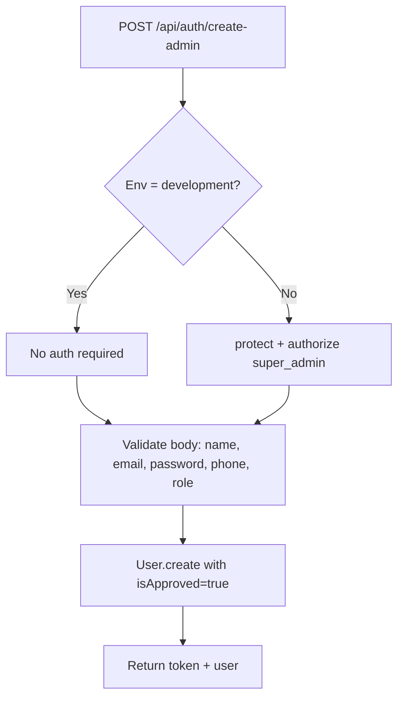
```mermaid
flowchart TB
    A[POST /api/auth/create-admin] --> B{Env = development?}
    B -->|Yes| C[No auth required]
    B -->|No| D[protect + authorize super_admin]
    C --> E[Validate body: name, email, password, phone, role]
    D --> E
    E --> F[User.create with isApproved=true]
    F --> G[Return token + user]
```

---

## 4. Visitor Management Flow

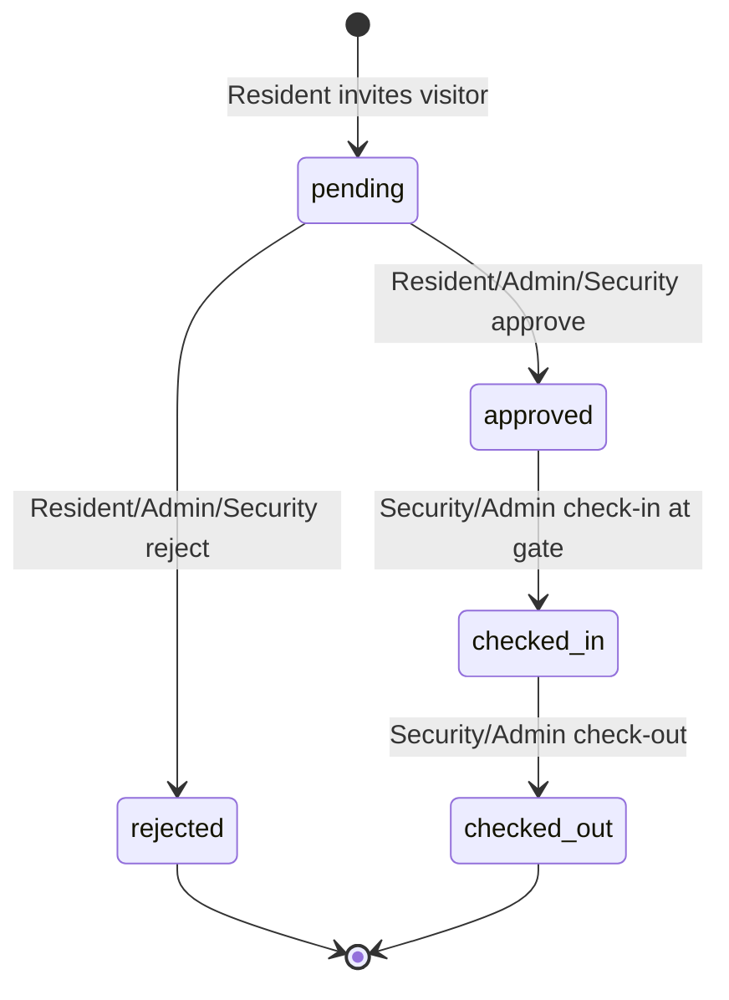
```mermaid
stateDiagram-v2
    [*] --> pending: Resident invites visitor
    pending --> approved: Resident/Admin/Security approve
    pending --> rejected: Resident/Admin/Security reject
    approved --> checked_in: Security/Admin check-in at gate
    checked_in --> checked_out: Security/Admin check-out
    rejected --> [*]
    checked_out --> [*]
```

**Sequence: Invite → Approve → Check-in → Check-out**

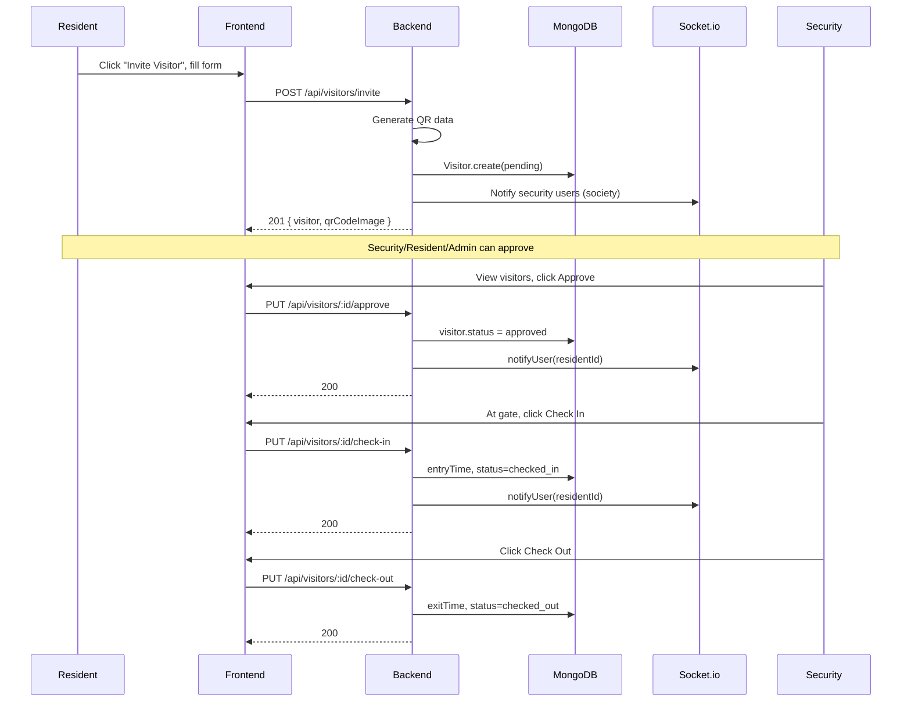
```mermaid
sequenceDiagram
    participant R as Resident
    participant F as Frontend
    participant API as Backend
    participant DB as MongoDB
    participant S as Socket.io
    participant Sec as Security

    R->>F: Click "Invite Visitor", fill form
    F->>API: POST /api/visitors/invite
    API->>API: Generate QR data
    API->>DB: Visitor.create(pending)
    API->>S: Notify security users (society)
    API-->>F: 201 { visitor, qrCodeImage }

    Note over R,Sec: Security/Resident/Admin can approve
    Sec->>F: View visitors, click Approve
    F->>API: PUT /api/visitors/:id/approve
    API->>DB: visitor.status = approved
    API->>S: notifyUser(residentId)
    API-->>F: 200

    Sec->>F: At gate, click Check In
    F->>API: PUT /api/visitors/:id/check-in
    API->>DB: entryTime, status=checked_in
    API->>S: notifyUser(residentId)
    API-->>F: 200

    Sec->>F: Click Check Out
    F->>API: PUT /api/visitors/:id/check-out
    API->>DB: exitTime, status=checked_out
    API-->>F: 200
```

---

## 5. Delivery Management Flow

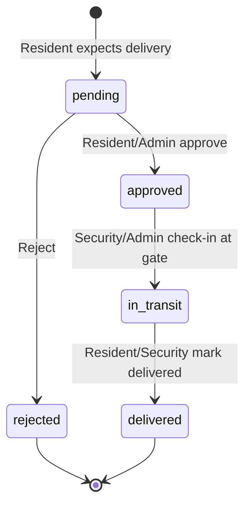
```mermaid
stateDiagram-v2
    [*] --> pending: Resident expects delivery
    pending --> approved: Resident/Admin approve
    pending --> rejected: Reject
    approved --> in_transit: Security/Admin check-in at gate
    in_transit --> delivered: Resident/Security mark delivered
    rejected --> [*]
    delivered --> [*]
```

**API flow:** `POST /deliveries/invite` → `PUT /:id/approve` → `PUT /:id/check-in` → `PUT /:id/deliver`. Notifications go to resident and (for invite) to security.

---

## 6. Vehicle Management Flow

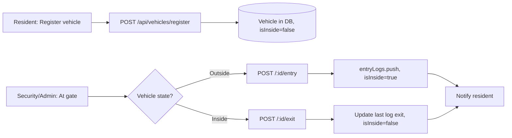
```mermaid
flowchart LR
    A[Resident: Register vehicle] --> B[POST /api/vehicles/register]
    B --> C[(Vehicle in DB, isInside=false)]
    D[Security/Admin: At gate] --> E{Vehicle state?}
    E -->|Outside| F[POST /:id/entry]
    E -->|Inside| G[POST /:id/exit]
    F --> H[entryLogs.push, isInside=true]
    G --> I[Update last log exit, isInside=false]
    H --> J[Notify resident]
    I --> J
```

---

## 7. Notice & Announcement Flow

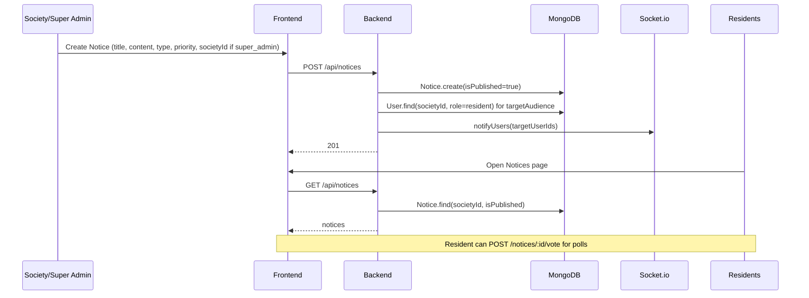
```mermaid
sequenceDiagram
    participant Admin as Society/Super Admin
    participant F as Frontend
    participant API as Backend
    participant DB as MongoDB
    participant S as Socket.io
    participant Res as Residents

    Admin->>F: Create Notice (title, content, type, priority, societyId if super_admin)
    F->>API: POST /api/notices
    API->>DB: Notice.create(isPublished=true)
    API->>DB: User.find(societyId, role=resident) for targetAudience
    API->>S: notifyUsers(targetUserIds)
    API-->>F: 201
    Res->>F: Open Notices page
    F->>API: GET /api/notices
    API->>DB: Notice.find(societyId, isPublished)
    API-->>F: notices
    Note over Res,F: Resident can POST /notices/:id/vote for polls
```

---

## 8. Complaint (Help Desk) Flow

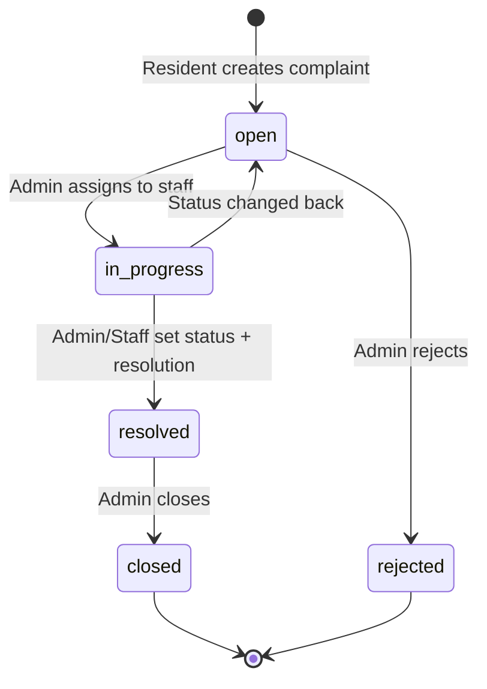
```mermaid
stateDiagram-v2
    [*] --> open: Resident creates complaint
    open --> in_progress: Admin assigns to staff
    in_progress --> resolved: Admin/Staff set status + resolution
    in_progress --> open: Status changed back
    resolved --> closed: Admin closes
    open --> rejected: Admin rejects
    closed --> [*]
    rejected --> [*]
```

**Sequence: Create → Assign → Update status → (optional) Add update**

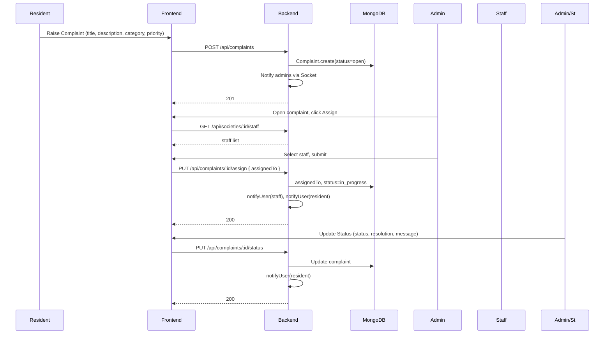
```mermaid
sequenceDiagram
    participant R as Resident
    participant F as Frontend
    participant API as Backend
    participant DB as MongoDB
    participant Admin as Admin
    participant St as Staff

    R->>F: Raise Complaint (title, description, category, priority)
    F->>API: POST /api/complaints
    API->>DB: Complaint.create(status=open)
    API->>API: Notify admins via Socket
    API-->>F: 201

    Admin->>F: Open complaint, click Assign
    F->>API: GET /api/societies/:id/staff
    API-->>F: staff list
    Admin->>F: Select staff, submit
    F->>API: PUT /api/complaints/:id/assign { assignedTo }
    API->>DB: assignedTo, status=in_progress
    API->>API: notifyUser(staff), notifyUser(resident)
    API-->>F: 200

    Admin/St->>F: Update Status (status, resolution, message)
    F->>API: PUT /api/complaints/:id/status
    API->>DB: Update complaint
    API->>API: notifyUser(resident)
    API-->>F: 200
```

---

## 9. Payment Flow

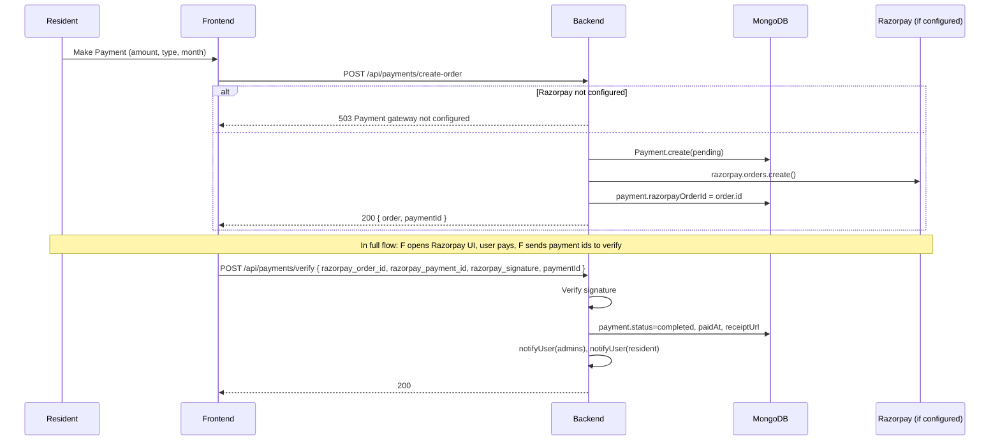
```mermaid
sequenceDiagram
    participant R as Resident
    participant F as Frontend
    participant API as Backend
    participant DB as MongoDB
    participant RPay as Razorpay (if configured)

    R->>F: Make Payment (amount, type, month)
    F->>API: POST /api/payments/create-order
    alt Razorpay not configured
        API-->>F: 503 Payment gateway not configured
    else
        API->>DB: Payment.create(pending)
        API->>RPay: razorpay.orders.create()
        API->>DB: payment.razorpayOrderId = order.id
        API-->>F: 200 { order, paymentId }
    end

    Note over R,RPay: In full flow: F opens Razorpay UI, user pays, F sends payment ids to verify
    F->>API: POST /api/payments/verify { razorpay_order_id, razorpay_payment_id, razorpay_signature, paymentId }
    API->>API: Verify signature
    API->>DB: payment.status=completed, paidAt, receiptUrl
    API->>API: notifyUser(admins), notifyUser(resident)
    API-->>F: 200
```

---

## 10. Amenity Booking Flow

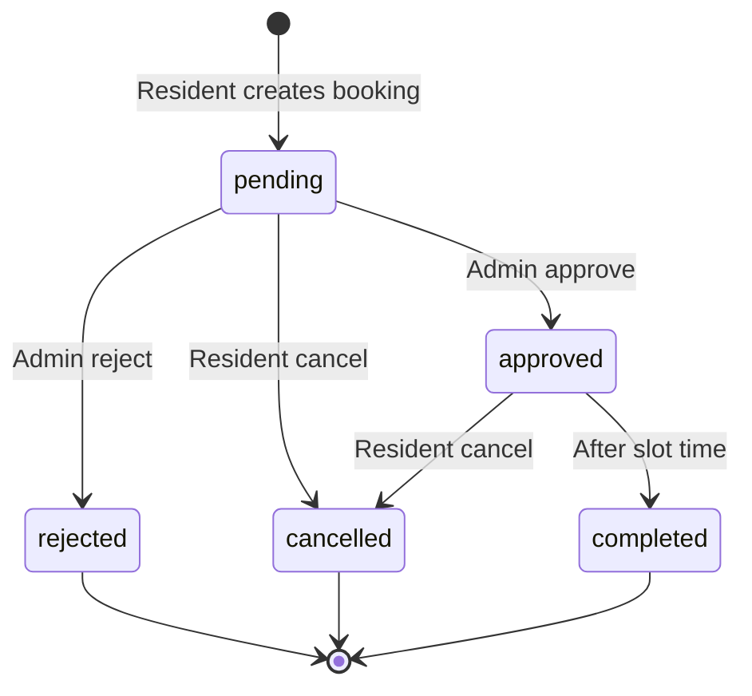
```mermaid
stateDiagram-v2
    [*] --> pending: Resident creates booking
    pending --> approved: Admin approve
    pending --> rejected: Admin reject
    pending --> cancelled: Resident cancel
    approved --> cancelled: Resident cancel
    approved --> completed: After slot time
    rejected --> [*]
    cancelled --> [*]
    completed --> [*]
```

**APIs:** `POST /api/bookings` (resident), `PUT /:id/approve`, `PUT /:id/reject` (admin), `PUT /:id/cancel` (resident). Conflict check on amenity + slot before create.

---

## 11. Society & User Management Flow

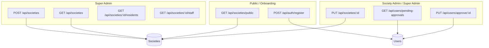
```mermaid
flowchart TB
    subgraph SuperAdmin["Super Admin"]
        A1[POST /api/societies]
        A2[GET /api/societies]
        A3[GET /api/societies/:id/residents]
        A4[GET /api/societies/:id/staff]
    end

    subgraph Registration["Public / Onboarding"]
        B1[GET /api/societies/public]
        B2[POST /api/auth/register]
    end

    subgraph AdminUser["Society Admin / Super Admin"]
        C1[GET /api/users/pending-approvals]
        C2[PUT /api/users/approve/:id]
        C3[PUT /api/societies/:id]
    end

    A1 --> Societies[(Societies)]
    A2 --> Societies
    B1 --> Societies
    B2 --> Users[(Users)]
    C1 --> Users
    C2 --> Users
    C3 --> Societies
```

---

## 12. Real-Time Notification Flow

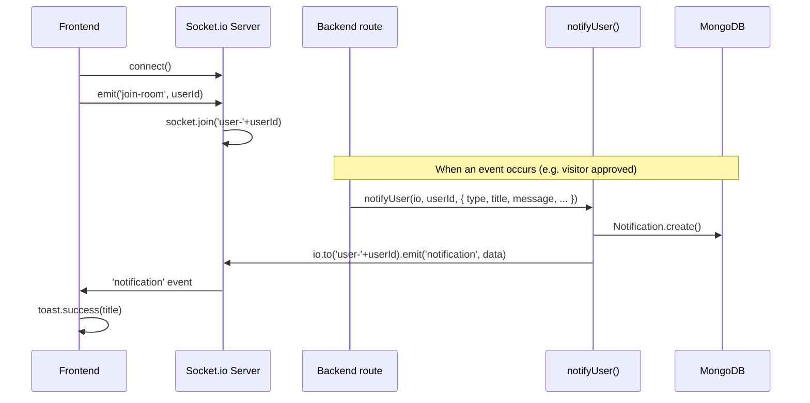
```mermaid
sequenceDiagram
    participant F as Frontend
    participant S as Socket.io Server
    participant API as Backend route
    participant N as notifyUser()
    participant DB as MongoDB

    F->>S: connect()
    F->>S: emit('join-room', userId)
    S->>S: socket.join('user-'+userId)

    Note over API,DB: When an event occurs (e.g. visitor approved)
    API->>N: notifyUser(io, userId, { type, title, message, ... })
    N->>DB: Notification.create()
    N->>S: io.to('user-'+userId).emit('notification', data)
    S->>F: 'notification' event
    F->>F: toast.success(title)
```

---

## 13. Frontend Route & Page Flow

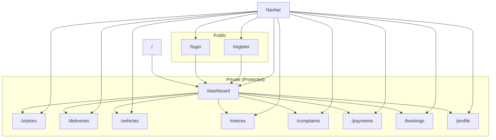
```mermaid
flowchart TB
    subgraph Public["Public"]
        Login["/login"]
        Register["/register"]
    end

    subgraph Private["Private (Protected)"]
        Dash["/dashboard"]
        Vis["/visitors"]
        Del["/deliveries"]
        Veh["/vehicles"]
        Not["/notices"]
        Comp["/complaints"]
        Pay["/payments"]
        Book["/bookings"]
        Prof["/profile"]
    end

    Home["/"] --> Dash
    Login --> Dash
    Register --> Dash
    Dash --> Vis
    Dash --> Del
    Dash --> Veh
    Dash --> Not
    Dash --> Comp
    Dash --> Pay
    Dash --> Book
    Dash --> Prof
    Navbar --> Login
    Navbar --> Register
    Navbar --> Dash
    Navbar --> Vis
    Navbar --> Del
    Navbar --> Veh
    Navbar --> Not
    Navbar --> Comp
    Navbar --> Pay
    Navbar --> Book
    Navbar --> Prof
```

---

## 14. End-to-End Scenario: New Resident to First Visitor

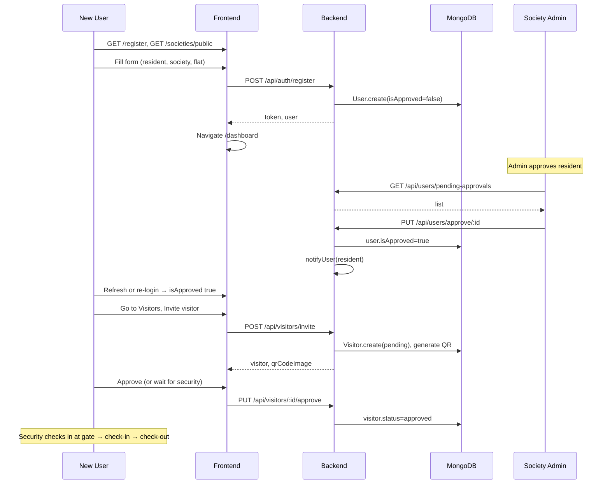
```mermaid
sequenceDiagram
    participant U as New User
    participant F as Frontend
    participant API as Backend
    participant DB as MongoDB
    participant Admin as Society Admin

    U->>F: GET /register, GET /societies/public
    U->>F: Fill form (resident, society, flat)
    F->>API: POST /api/auth/register
    API->>DB: User.create(isApproved=false)
    API-->>F: token, user
    F->>F: Navigate /dashboard

    Note over Admin: Admin approves resident
    Admin->>API: GET /api/users/pending-approvals
    API-->>Admin: list
    Admin->>API: PUT /api/users/approve/:id
    API->>DB: user.isApproved=true
    API->>API: notifyUser(resident)

    U->>F: Refresh or re-login → isApproved true
    U->>F: Go to Visitors, Invite visitor
    F->>API: POST /api/visitors/invite
    API->>DB: Visitor.create(pending), generate QR
    API-->>F: visitor, qrCodeImage
    U->>F: Approve (or wait for security)
    F->>API: PUT /api/visitors/:id/approve
    API->>DB: visitor.status=approved
    Note over U: Security checks in at gate → check-in → check-out
```

---

## 15. API Route Reference (by Module)

| Module | Method | Path | Who | Description |
|--------|--------|------|-----|-------------|
| **Auth** | POST | /api/auth/register | Public | Register |
| | POST | /api/auth/login | Public | Login |
| | GET | /api/auth/me | User | Current user |
| | POST | /api/auth/forgot-password | Public | Forgot password |
| | PUT | /api/auth/reset-password/:token | Public | Reset password |
| | PUT | /api/auth/update-password | User | Change password |
| | POST | /api/auth/create-admin | Dev / SuperAdmin | Create admin |
| **Societies** | GET | /api/societies/public | Public | List societies (for register) |
| | GET | /api/societies | User | List societies (filtered by role) |
| | POST | /api/societies | SuperAdmin | Create society |
| | GET | /api/societies/:id | User | Get society |
| | GET | /api/societies/:id/staff | Admin | List staff |
| | GET | /api/societies/:id/residents | Admin | List residents |
| | PUT | /api/societies/:id | Admin | Update society |
| **Visitors** | POST | /api/visitors/invite | Resident | Invite visitor |
| | GET | /api/visitors | User | List visitors |
| | GET | /api/visitors/:id | User | Get visitor |
| | GET | /api/visitors/logs/today | Security/Admin | Today's logs |
| | PUT | /api/visitors/:id/approve | Resident/Security/Admin | Approve |
| | PUT | /api/visitors/:id/reject | Resident/Security/Admin | Reject |
| | PUT | /api/visitors/:id/check-in | Security/Admin | Check-in |
| | PUT | /api/visitors/:id/check-out | Security/Admin | Check-out |
| **Deliveries** | POST | /api/deliveries/invite | Resident | Expect delivery |
| | GET | /api/deliveries | User | List deliveries |
| | GET | /api/deliveries/:id | User | Get delivery |
| | PUT | /api/deliveries/:id/approve | Resident/Security/Admin | Approve |
| | PUT | /api/deliveries/:id/check-in | Security/Admin | Check-in |
| | PUT | /api/deliveries/:id/deliver | Resident/Security/Admin | Mark delivered |
| **Vehicles** | POST | /api/vehicles/register | Resident | Register vehicle |
| | GET | /api/vehicles | User | List vehicles |
| | GET | /api/vehicles/:id | User | Get vehicle |
| | GET | /api/vehicles/search/:number | Security/Admin | Search by number |
| | POST | /api/vehicles/:id/entry | Security/Admin | Log entry |
| | POST | /api/vehicles/:id/exit | Security/Admin | Log exit |
| **Notices** | POST | /api/notices | Admin | Create notice |
| | GET | /api/notices | User | List notices |
| | GET | /api/notices/:id | User | Get notice |
| | POST | /api/notices/:id/vote | Resident | Vote on poll |
| | PUT | /api/notices/:id | Admin | Update notice |
| | DELETE | /api/notices/:id | Admin | Soft delete |
| **Complaints** | POST | /api/complaints | Resident | Create complaint |
| | GET | /api/complaints | User | List complaints |
| | GET | /api/complaints/:id | User | Get complaint |
| | PUT | /api/complaints/:id/assign | Admin | Assign to staff |
| | PUT | /api/complaints/:id/status | Admin/Staff | Update status |
| | POST | /api/complaints/:id/update | User | Add update |
| **Payments** | POST | /api/payments/create-order | Resident | Create Razorpay order |
| | POST | /api/payments/verify | Resident | Verify payment |
| | GET | /api/payments | User | List payments |
| | GET | /api/payments/:id | User | Get payment |
| | GET | /api/payments/history/summary | Resident | Summary |
| **Bookings** | POST | /api/bookings | Resident | Create booking |
| | GET | /api/bookings | User | List bookings |
| | GET | /api/bookings/availability | User | Check slot |
| | PUT | /api/bookings/:id/approve | Admin | Approve |
| | PUT | /api/bookings/:id/reject | Admin | Reject |
| | PUT | /api/bookings/:id/cancel | Resident | Cancel |
| **Users** | GET | /api/users/notifications | User | List notifications |
| | PUT | /api/users/notifications/:id/read | User | Mark read |
| | PUT | /api/users/notifications/read-all | User | Mark all read |
| | GET | /api/users/pending-approvals | Admin | Pending residents |
| | PUT | /api/users/approve/:id | Admin | Approve resident |
| | PUT | /api/users/profile | User | Update profile |

---

*Generated from codebase analysis. For implementation details, see `backend/routes/` and `frontend/src/pages/`.*
